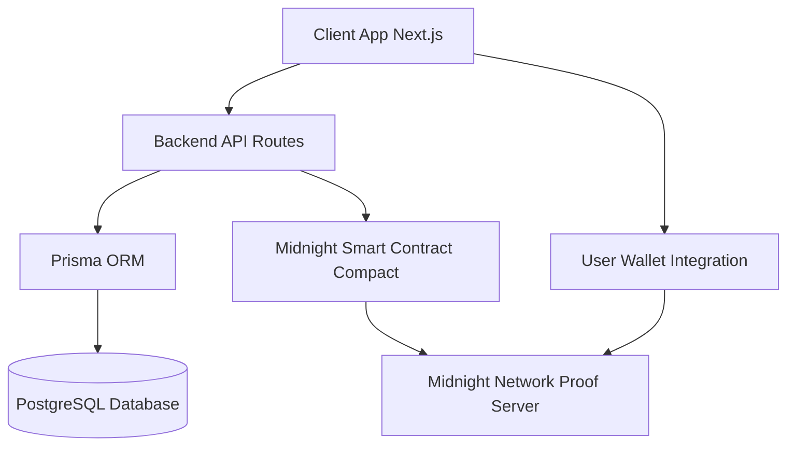

<div align="center">
  <h1>ZERA</h1>
  <p><strong>The Institutional-Grade Digital Asset Marketplace</strong></p>
</div>

<br />

> [!NOTE]  
> NFTs are still seen as speculative toys, not serious assets. ZERA changes that by turning digital assets into verified, private, and compliant financial primitives built for real ownership.

> [!IMPORTANT]  
> Most marketplaces are optimized for hype, visibility, and speculation. ZERA optimizes for legitimacy, trust, and enforceability.

<br />

<p align="center">
  
</p>

<br />

<p align="center">
  
  
  
  
  
  
  
  
  
</p>

<br />

> [!TIP]
> An asset registry and ownership management platform for the Midnight Network that enables cryptographically-verified asset registration, verification, and ownership transfer on the blockchain.

## Architecture

> [!NOTE]  
> For a more detailed breakdown of our system components, please refer to our full documentation.



<details>
<summary><b>Prerequisites</b></summary>
<br/>

> [!WARNING]  
> Ensure you have the exact Node and Bun versions specified to avoid compilation errors.

- Node.js >= 22.0.0
- Bun >= 1.0.0
- Docker (for local network and DB)
- Cargo/Rust (for storage service)
- Compact compiler (for contract compilation)

</details>

<details>
<summary><b>Installation & Compilation</b></summary>
<br/>

### Installation

```bash
bun install
```

### Setup the Entire Project

> [!IMPORTANT]  
> Before deploying or testing, run the preparation script to compile the smart contracts, set up the database, and configure services:

```bash
bun run project:prepare
```

This generates the contract artifacts, sets up Prisma, and starts the local Docker services.

</details>

<details>
<summary><b>Deploy to Preprod Network</b></summary>
<br/>

Deploy the contract to Midnight's preprod network:

```bash
bun run deploy
```

This will:
1. Prompt you to create a new wallet or restore from an existing seed
2. Display your wallet address for funding
3. Wait for you to fund the wallet via the [Midnight Faucet](https://faucet.preprod.midnight.network/)
4. Wait for DUST to be generated
5. Deploy the contract
6. Save deployment info to `deployment.json`

> [!NOTE]  
> The preprod deployment uses the public proof server at `https://lace-proof-pub.preprod.midnight.network`, so you don't need to run Docker.

</details>

<details>
<summary><b>Local Development & Testing</b></summary>
<br/>

> [!TIP]
> For local testing, you can use the built-in commands to manage services and run tests.

```bash
# Start local network and services (indexer, node, proof server, postgres)
bun run services:up

# Run tests against local network
bun run test

# Stop local network and services
bun run services:down

# Or start everything for local development (Next.js, Storage, Contract deploy)
bun run start:all
```

</details>

<details>
<summary><b>Network Configuration</b></summary>
<br/>

The project supports two networks:

- **Local**: Uses Docker Compose services (requires `bun run services:up`)
- **Preprod**: Uses public Midnight preprod endpoints (no Docker needed)

> [!CAUTION]
> Always verify the network configuration before executing deployment commands to avoid deploying sensitive data locally or test data to preprod.

Set the network via the `MIDNIGHT_NETWORK` environment variable:
- `local` - Local development network
- `preprod` - Midnight preprod testnet (default for deploy)

</details>

<details>
<summary><b>Project Structure</b></summary>
<br/>

```text
.
├── web/                      # Next.js Frontend App (Zustand, Tailwind, Prisma)
├── contracts/                # Midnight Network Smart Contracts (Compact)
├── storage/                  # Rust/Cargo Storage Service
├── scripts/                  # Utility scripts
├── package.json              # Bun Workspace configuration
└── compose.yml               # Docker services for Midnight + Postgres
```

</details>

<details>
<summary><b>Smart Contract</b></summary>
<br/>

The contract (`contracts/main.compact`) provides an Asset Registry with the following features:

### Ledger State
- **assetCount**: Counter tracking total registered assets
- **assets**: Map of registered assets indexed by ID
- **commitments**: Map of asset commitments for duplicate prevention
- **ownershipCommitments**: Map tracking asset ownership relationships

### Circuits (Functions)
- **registerAsset**(assetHash, metadataHash, timestamp) - Register a new asset
- **verifyAsset**(assetHash, creatorPublicKey) - Verify asset authenticity
- **assetExists**(id) - Check if an asset exists
- **getAsset**(id) - Retrieve asset data
- **assignOwnership**(assetId) - Assign ownership to an asset
- **transferOwnership**(assetId, newOwnerPublicKey) - Transfer asset ownership
- **verifyOwnership**(assetId, publicKey) - Verify asset ownership

</details>

<details>
<summary><b>Available Scripts</b></summary>
<br/>

- `bun install` - Install dependencies for all workspaces
- `bun run project:prepare` - Full project setup (compiles, copies artifacts, DB setup)
- `bun run services:up` - Start local Docker services
- `bun run services:down` - Stop local Docker services
- `bun run start:all` - Start web UI, storage API, and deploy locally
- `bun run test` - Run smart contract tests
- `bun run deploy` - Deploy contracts to the network

</details>

<details>
<summary><b>Troubleshooting</b></summary>
<br/>

### Native Module Build Warnings

> [!NOTE]  
> You may see warnings about `cpu-features` or other native modules during installation. These are non-fatal and don't affect functionality.

### Contract Not Found

> [!WARNING]  
> If you see "Cannot find module '../contracts/index.js'", run:

```bash
bun run compact:compile
```

### Local Network Issues

> [!CAUTION]
> If local tests fail, ensure Docker is running and services are healthy:

```bash
bun run services:up
docker compose ps
```

</details>

---

<p align="center">
  Built with ❤️ during Hilo Hack
</p>
