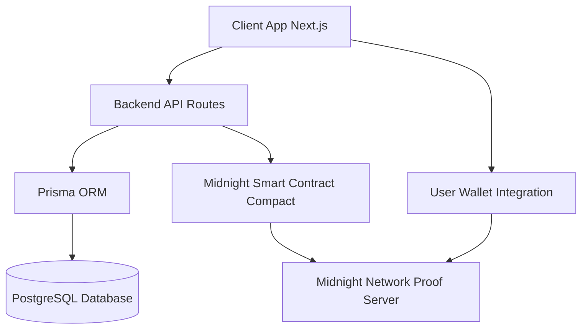

# ZERA

An institutional-grade digital asset marketplace that turns digital assets into verified, private, and compliant financial primitives built for real ownership.

<br />

<p align="center">
  
</p>

<br />

<p align="center">
  
  
  
  
</p>

<p align="center">
  
  
  
  
  
  
  
</p>

---

## Vision

> [!NOTE]  
> **NFTs were supposed to redefine ownership. Instead, they became synonymous with speculation.**
> 
> Ownership can be faked. Assets can be duplicated. Identity is either exposed or completely absent. Compliance doesn’t exist.
> So the market reacted accordingly: **NFTs are still seen as speculative toys, not serious assets.**

**ZERA changes that.**  
We are not building another marketplace. We are rebuilding the foundation of digital ownership.

Most marketplaces optimize for hype, visibility, and speculation.  
**ZERA optimizes for legitimacy, trust, and enforceability.**

### The Paradigm Shift

| Feature | Traditional NFT Platforms | ZERA |
|---------|-------------------------|------|
| **Core Focus** | Visibility and Hype | Verifiability and Legitimacy |
| **Authenticity** | Assumed | Cryptographically Verified |
| **Privacy** | Public and Exposed | Private Ownership |
| **Compliance** | Non-existent | Enforceable via Math |

---

## Business Development & Viability

ZERA unlocks participation from markets that traditional NFT platforms cannot reach. By embedding privacy and compliance at the protocol level, it enables:

- **Institutional participation**
- **Regulated asset trading**
- **High-value asset tokenization**

This is where digital assets transition from speculative instruments to **financial infrastructure**.  
> [!IMPORTANT]  
> When trust becomes provable, markets expand.
---


## Product

ZERA is a **verification-first, privacy-preserving** asset registry and marketplace. It replaces trust assumptions with cryptographic proof systems.

### Core Features

<details>
<summary><b>Verified Asset Registry</b></summary>
<br/>

1. *Verification Mandatory* &nbsp;&rarr;&nbsp; Assets must undergo strict cryptographic verification prior to being listed on the public registry.
2. *Fraud Prevention* &nbsp;&rarr;&nbsp; By comparing asset hashes on-chain, the protocol actively prevents duplication and the creation of counterfeit assets.
3. *Marketplace Integrity* &nbsp;&rarr;&nbsp; Ensures complete ecosystem legitimacy by tying every asset to an immutable identity.

</details>

<details>
<summary><b>Proof of Authenticity</b></summary>
<br/>

1. *Creator Signatures* &nbsp;&rarr;&nbsp; Every listing is backed by verifiable digital signatures from the original creator.
2. *Source Verification* &nbsp;&rarr;&nbsp; Authenticity is strictly enforced at the smart contract level before any transaction can occur.
3. *Cryptographic Legitimacy* &nbsp;&rarr;&nbsp; Every asset flowing through the protocol is guaranteed authentic by the network.

</details>

<details>
<summary><b>Private Ownership</b></summary>
<br/>

1. *Identity Protection* &nbsp;&rarr;&nbsp; Prove that you own an asset without ever revealing your personal identity.
2. *No Wallet Exposure* &nbsp;&rarr;&nbsp; Public addresses and financial histories are kept entirely private.
3. *Provable, Not Visible* &nbsp;&rarr;&nbsp; Ownership becomes a mathematical fact, not a public spectacle.

</details>

<details>
<summary><b>Proof of Eligibility</b></summary>
<br/>

1. *Zero-Knowledge KYC* &nbsp;&rarr;&nbsp; Verify regulatory compliance without exposing underlying personal data.
2. *Private Trading* &nbsp;&rarr;&nbsp; Prove your eligibility to trade an asset without revealing who you are.
3. *Compliance via Math* &nbsp;&rarr;&nbsp; Achieve regulatory adherence through cryptographic proofs rather than mass surveillance.

</details>

<details>
<summary><b>Private Transactions</b></summary>
<br/>

1. *Secure Transfers* &nbsp;&rarr;&nbsp; Execute fully compliant and secure asset movements.
2. *Private Execution* &nbsp;&rarr;&nbsp; Trades happen under complete privacy using shielded states.
3. *Step-by-step Verification* &nbsp;&rarr;&nbsp; ZK-proofs verify the integrity of the trade at every step of the transaction loop.

</details>
---

## Product Flow

ZERA's architecture enforces a strict sequence of cryptographic operations to ensure that assets transition smoothly from creation to ownership.

<details>
<summary><b>Asset Creation Lifecycle</b></summary>
<br/>

> The journey of a new digital asset entering the ZERA ecosystem.

1. *Upload* &nbsp;&rarr;&nbsp; The creator uploads the initial asset metadata.
2. *Sign* &nbsp;&rarr;&nbsp; A cryptographic signature is attached to establish provenance.
3. *Verify* &nbsp;&rarr;&nbsp; ZK-proofs validate the source without revealing sensitive creator data.
4. *Register* &nbsp;&rarr;&nbsp; The asset is permanently recorded on the Midnight ledger.
5. *Trade* &nbsp;&rarr;&nbsp; The asset enters the marketplace as a verified primitive.

</details>

<details>
<summary><b>Asset Acquisition Flow</b></summary>
<br/>

> How compliance and privacy are maintained during a purchase.

1. *Generate Proof* &nbsp;&rarr;&nbsp; Buyer generates an eligibility proof locally.
2. *Verify Compliance* &nbsp;&rarr;&nbsp; The network verifies compliance mathematically.
3. *Execute Transfer* &nbsp;&rarr;&nbsp; Ownership transfers securely and privately.

</details>

<details>
<summary><b>Ownership Verification</b></summary>
<br/>

> Proving ownership post-transaction without exposing the wallet.

1. *Generate Proof* &nbsp;&rarr;&nbsp; Owner generates a zero-knowledge proof of ownership.
2. *Verify* &nbsp;&rarr;&nbsp; The proof is verified against the shielded contract state.
3. *Confirm* &nbsp;&rarr;&nbsp; Full, trustless confirmation without revealing identity.

</details>


---

## Use Cases

Because ZERA operates at the intersection of privacy, compliance, and provable ownership, it enables entirely new classes of digital commerce.

<details>
<summary><b>Primary Applications</b></summary>
<br/>

+ *High-Value Digital Art*
  Provides verifiable provenance and secondary market royalties while keeping collector portfolios private.
  
+ *Tokenized Real-World Assets (RWAs)*
  Supports fractional ownership of real estate, luxury goods, or commodities with built-in regulatory compliance.
  
+ *Sensitive Digital Intellectual Property*
  Securely registers patents, trade secrets, and exclusive IP with zero-knowledge proof of ownership.
  
+ *Institutional-Grade Trading*
  Allows hedge funds and financial institutions to clear digital assets securely without exposing their strategies.

</details>


---

## Future Scope

The current implementation is just the beginning. ZERA is architected to scale into a comprehensive financial layer for the broader digital economy.

<details>
<summary><b>Roadmap & Expansions</b></summary>
<br/>

> We are actively researching and developing the following capabilities:

1. *Multi-Asset Class Support* 
   Expanding the contract schema to accommodate complex financial instruments like tokenized securities and debt.

2. *Regulatory Integrations* 
   Building automated compliance oracles that adapt to specific jurisdictional laws in real-time.

3. *Institutional Custody Solutions* 
   Collaborating with major custodians to enable multisig, threshold signature, and cold storage natively.

4. *Cross-Chain Verification* 
   Utilizing zero-knowledge bridges to verify asset state and ownership across Ethereum, Polkadot, and Cardano.

5. *Reputation Systems* 
   Establishing on-chain, privacy-preserving trust scores for users based on transaction history and verification status.

</details>

---

## Architecture

> [!NOTE]  
> For a more detailed breakdown of our system components, please refer to our full documentation.



<details>
<summary><b>Prerequisites</b></summary>
<br/>

> [!WARNING]  
> Ensure you have the exact Node and Bun versions specified to avoid compilation errors.

- Node.js >= 22.0.0
- Bun >= 1.0.0
- Docker (for local network and DB)
- Cargo/Rust (for storage service)
- Compact compiler (for contract compilation)

</details>

<details>
<summary><b>Installation & Compilation</b></summary>
<br/>

### Installation

```bash
bun install
```

### Setup the Entire Project

> [!IMPORTANT]  
> Before deploying or testing, run the preparation script to compile the smart contracts, set up the database, and configure services:

```bash
bun run project:prepare
```

This generates the contract artifacts, sets up Prisma, and starts the local Docker services.

</details>

<details>
<summary><b>Deploy to Preprod Network</b></summary>
<br/>

Deploy the contract to Midnight's preprod network:

```bash
bun run deploy
```

This will:
1. Prompt you to create a new wallet or restore from an existing seed
2. Display your wallet address for funding
3. Wait for you to fund the [Midnight Faucet](https://faucet.preprod.midnight.network/)
4. Wait for DUST to be generated
5. Deploy the contract
6. Save deployment info to `deployment.json`

> [!NOTE]  
> The preprod deployment uses the public proof server at `https://lace-proof-pub.preprod.midnight.network`, so you don't need to run Docker.

</details>

<details>
<summary><b>Local Development & Testing</b></summary>
<br/>

> [!TIP]
> For local testing, you can use the built-in commands to manage services and run tests.

```bash
# Start local network and services (indexer, node, proof server, postgres)
bun run services:up

# Run tests against local network
bun run test

# Stop local network and services
bun run services:down

# Or start everything for local development (Next.js, Storage, Contract deploy)
bun run start:all
```

</details>

<details>
<summary><b>Network Configuration</b></summary>
<br/>

The project supports two networks:

- **Local**: Uses Docker Compose services (requires `bun run services:up`)
- **Preprod**: Uses public Midnight preprod endpoints (no Docker needed)

> [!CAUTION]
> Always verify the network configuration before executing deployment commands to avoid deploying sensitive data locally or test data to preprod.

Set the network via the `MIDNIGHT_NETWORK` environment variable:
- `local` - Local development network
- `preprod` - Midnight preprod testnet (default for deploy)

</details>

<details>
<summary><b>Project Structure</b></summary>
<br/>

```text
.
├── web/                      # Next.js Frontend App (Zustand, Tailwind, Prisma)
├── contracts/                # Midnight Network Smart Contracts (Compact)
├── storage/                  # Rust/Cargo Storage Service
├── scripts/                  # Utility scripts
├── package.json              # Bun Workspace configuration
└── compose.yml               # Docker services for Midnight + Postgres
```

</details>

<details>
<summary><b>Smart Contract</b></summary>
<br/>

The contract (`contracts/main.compact`) provides an Asset Registry with the following features:

### Ledger State
- **assetCount**: Counter tracking total registered assets
- **assets**: Map of registered assets indexed by ID
- **commitments**: Map of asset commitments for duplicate prevention
- **ownershipCommitments**: Map tracking asset ownership relationships

### Circuits (Functions)
- **registerAsset**(assetHash, metadataHash, timestamp) - Register a new asset
- **verifyAsset**(assetHash, creatorPublicKey) - Verify asset authenticity
- **assetExists**(id) - Check if an asset exists
- **getAsset**(id) - Retrieve asset data
- **assignOwnership**(assetId) - Assign ownership to an asset
- **transferOwnership**(assetId, newOwnerPublicKey) - Transfer asset ownership
- **verifyOwnership**(assetId, publicKey) - Verify asset ownership

</details>

<details>
<summary><b>Available Scripts</b></summary>
<br/>

- `bun install` - Install dependencies for all workspaces
- `bun run project:prepare` - Full project setup (compiles, copies artifacts, DB setup)
- `bun run services:up` - Start local Docker services
- `bun run services:down` - Stop local Docker services
- `bun run start:all` - Start web UI, storage API, and deploy locally
- `bun run test` - Run smart contract tests
- `bun run deploy` - Deploy contracts to the network

</details>

<details>
<summary><b>Troubleshooting</b></summary>
<br/>

### Native Module Build Warnings

> [!NOTE]  
> You may see warnings about `cpu-features` or other native modules during installation. These are non-fatal and don't affect functionality.

### Contract Not Found

> [!WARNING]  
> If you see "Cannot find module '../contracts/index.js'", run:

```bash
bun run compact:compile
```

### Local Network Issues

> [!CAUTION]
> If local tests fail, ensure Docker is running and services are healthy:

```bash
bun run services:up
docker compose ps
```

</details>

---

<p align="center">
  
</p>
