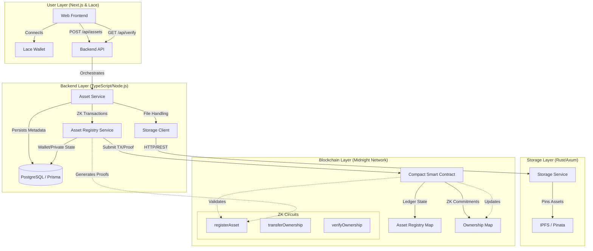

# Zera Architecture

## Overview

**Zera** is a privacy-first asset registry and marketplace built on **Midnight Network**. It enables cryptographically-verified ownership and authenticity proofs for digital assets while maintaining privacy through zero-knowledge proofs.

### Core Philosophy

- **Contracts handle proofs**: Ownership registry and verification logic lives on-chain
- **Backend handles business logic**: Asset metadata, transfers, and marketplace operations are managed off-chain
- **IPFS for storage**: Asset files and metadata stored on decentralized IPFS
- **Lace Wallet integration**: Users connect via Lace Wallet for tNight transfers and ownership proofs

---

## System Architecture



---

## Component Breakdown

### 1. Smart Contract Architecture (`/contracts`)

**Language**: Compact (Midnight's ZK-enabled smart contract language)  
**File**: `contracts/src/main.compact`

The core of ZERA's privacy and authenticity guarantees lies in its smart contract architecture. Rather than storing plaintext ownership records, the contract relies on cryptographic **commitments** and **zero-knowledge proofs**.

#### Ledger State
The contract maintains a strictly minimized public ledger:
- `assetCount`: Counter for total registered assets.
- `assets`: Map of basic public asset data (creator public key, metadata hashes, timestamps).
- `commitments`: Map preventing duplicate asset registration based on asset hashes.
- `ownershipCommitments`: Map tracking ownership via ZK commitments instead of plaintext public keys.

#### Circuits (On-Chain Functions)
Functions in Compact act as **Zero-Knowledge Circuits**. They verify off-chain generated proofs without exposing private inputs.
- **registerAsset**(assetHash, metadataHash, timestamp) → Registers a new asset while proving the creator's identity secretly.
- **verifyAsset**(assetHash, creatorPublicKey) → Reads the public ledger to verify authenticity.
- **assetExists**(id) → Checks if an asset exists on-chain.
- **getAsset**(id) → Retrieves public asset metadata from the ledger.
- **assignOwnership**(assetId) → Initializes an ownership commitment for a newly minted asset.
- **transferOwnership**(assetId, newOwnerPublicKey) → The core of ZERA's private trading. It requires a proof of knowledge of the *current* owner's secret key to securely update the commitment to the *new* owner's public key.
- **verifyOwnership**(assetId, publicKey) → Mathematically verifies that a given public key corresponds to the hidden ownership commitment without exposing the wallet.

#### Architectural Flow: Ownership & Privacy
1. When an asset is minted, an **Ownership Commitment** is generated by hashing a domain separator and the owner's public key.
2. This commitment is written to the `ownershipCommitments` map on the ledger.
3. During a transfer, the current owner provides their `ownerSecretKey` as a **witness** (private input). The circuit generates a ZK proof that the secret key matches the stored commitment.
4. If valid, the circuit deletes the old commitment and generates a new one using the buyer's public key.
5. The public state only shows that a commitment changed; it does not reveal the identities of the buyer or seller.

#### Witnesses (Private Inputs)
Witnesses execute strictly on the client/backend side during proof generation. They are never sent to the blockchain.
- `creatorSecretKey()`: 32-byte secret for proving asset creation.
- `ownerSecretKey()`: 32-byte secret for proving ownership and authorizing transfers.

**Key Files**:
- `contracts/src/main.compact` - Smart contract source
- `contracts/src/deploy.ts` - Deployment script
- `contracts/src/witness.ts` - Witness provider for ZK proofs
- `contracts/src/managed/zera/` - Compiled contract artifacts

---

### 2. Web Frontend (`/web`)

**Framework**: Next.js 14 (App Router)  
**Database**: PostgreSQL + Prisma ORM  
**Wallet**: Lace Wallet (Midnight Network)

#### Frontend Features
- **Lace Wallet Connection**: Connect wallet, view balances (tNight, DUST)
- **Asset Listing**: Browse verified assets from registry
- **Asset Creation**: Upload to IPFS → Register on-chain → Store metadata
- **Asset Purchase**: Wallet-to-wallet tNight transfer + ownership proof
- **Ownership Verification**: Generate and verify ZK ownership proofs
- **Transfer History**: View all asset transfers and activities

#### Key Frontend Files
- `web/src/lib/midnight-wallet.ts` - Lace wallet integration
- `web/src/app/page.tsx` - Homepage
- `web/src/app/explore/page.tsx` - Asset marketplace
- `web/src/app/create-asset/page.tsx` - Asset minting
- `web/src/app/wallet/page.tsx` - Wallet dashboard

#### API Routes (`/web/src/app/api`)
- `POST /api/assets` - Create new asset
- `GET /api/assets` - List assets (with filters)
- `GET /api/assets/[id]` - Get asset details
- `POST /api/assets/[id]/transfer` - Transfer asset ownership
- `GET /api/assets/[id]/verify` - Verify asset authenticity
- `GET /api/assets/owner/[ownerAddress]` - Get assets by owner

#### Database Schema (`web/prisma/schema.prisma`)
```prisma
Asset {
  id, contractAssetId, metadataUri, creator, owner,
  isPrivate, verified, ipfsCid, metadataHash,
  title, description, imageUrl, price, badges
}

Activity {
  type: MINT | TRANSFER | SALE | LIST | BURN
  assetId, from, to, price, txHash
}

Listing {
  assetId, seller, buyer, price, status
}

ProofLog {
  kind: OWNERSHIP | ELIGIBILITY
  assetId, wallet, result
}
```

---

### 3. Backend Services (`/web/src/server`)

#### Asset Service (`assetService.ts`)
- **createAsset()**: Register asset on-chain + store in DB
- **listAssets()**: Query assets with filters (verified, private, search)
- **transferAsset()**: Transfer ownership on-chain + update DB
- **verifyAssetById()**: Verify asset authenticity via contract
- **verifyOwnershipById()**: Verify ownership via ZK proof

#### Contract Service (`assetRegistryService.ts`)
- **registerAsset()**: Submit `registerAsset` circuit to contract
- **assignOwnership()**: Submit `assignOwnership` circuit
- **transferOwnership()**: Submit `transferOwnership` circuit with new owner public key
- **verifyOwnership()**: Read ledger state to verify ownership commitment
- **verifyAssetAuthenticity()**: Read ledger to verify asset commitment
- **assetExists()**: Check if asset exists in ledger
- **getAsset()**: Retrieve asset data from ledger

**Backend Wallet**:
- Uses testkit ALICE_SEED for local development
- Uses environment seed for preprod/mainnet
- Wallet state persisted in PostgreSQL for serverless compatibility

**Source of Truth**: The on-chain contract ledger is the authoritative source of truth for all ownership and asset data. The PostgreSQL database serves as a cached index for fast queries and UI rendering. All critical operations (transfers, verification) are validated against the contract state, not the database.

---

### 4. Storage Service (`/storage`)

**Language**: Rust (Axum framework)  
**IPFS Provider**: Pinata

#### Endpoints
- `POST /upload` - Upload file to IPFS (public or private)
- `GET /fetch/:cid` - Fetch file from IPFS by CID
- `GET /verify/:cid` - Verify CID is reachable
- `GET /health` - Health check

#### IPFS Client (`storage/src/ipfs.rs`)
- **upload_bytes_with_retry_private()**: Upload to Pinata with retry logic
- **fetch_file_with_retry()**: Fetch from multiple IPFS gateways
- **verify_cid()**: Check if CID is accessible

**Key Files**:
- `storage/src/main.rs` - Server entry point
- `storage/src/handlers.rs` - HTTP handlers
- `storage/src/ipfs.rs` - IPFS client logic

**Privacy Model**: "Private" assets use Pinata's access-controlled pinning, meaning the backend acts as a gatekeeper for access. For true end-to-end privacy, assets can be encrypted client-side before upload (future enhancement). Current implementation provides access control rather than cryptographic privacy.

---

## Data Flow

### Asset Creation Flow
```
1. User uploads file to IPFS via storage service
   ↓
2. Storage service returns CID (Content Identifier)
   ↓
3. Frontend calls POST /api/assets with metadata + CID
   ↓
4. Backend calls registerAsset() on smart contract
   ↓
5. Contract generates ZK proof and stores asset commitment
   ↓
6. Backend stores asset metadata in PostgreSQL
   ↓
7. Backend calls assignOwnership() + transferOwnership()
   ↓
8. Asset is now registered and owned by creator
```

### Asset Transfer Flow
```
1. Buyer connects Lace Wallet
   ↓
2. Buyer sends tNight to seller via wallet-to-wallet transfer
   ↓
3. Frontend calls POST /api/assets/[id]/transfer
   ↓
4. Backend calls transferOwnership(assetId, newOwnerPublicKey)
   ↓
5. Contract verifies current owner via ZK proof
   ↓
6. Contract updates ownershipCommitments map
   ↓
7. Backend updates asset.owner in PostgreSQL
   ↓
8. Activity log created (type: TRANSFER)
```

**Note on Atomicity**: For hackathon simplicity, payment (step 2) and ownership transfer (step 4) are decoupled. This means payment and ownership are not atomically linked. In production, this would be replaced with:
- **Escrow contract**: Holds payment until ownership transfer completes
- **Atomic settlement**: Single transaction that validates payment and transfers ownership
- **Rollback mechanism**: Refunds payment if ownership transfer fails

### Ownership Verification Flow
```
1. User claims ownership of asset
   ↓
2. Frontend calls GET /api/assets/[id]/verify?owner=<address>
   ↓
3. Backend calls verifyOwnership(assetId, claimedOwner)
   ↓
4. Contract derives public key from owner address
   ↓
5. Contract computes ownership commitment
   ↓
6. Contract checks if commitment matches ledger
   ↓
7. Returns verified: true/false
```

---

## Security & Privacy

### Zero-Knowledge Proofs
- **Creator Identity**: Derived from `creatorSecretKey` via `deriveCreatorPublicKey()`
- **Owner Identity**: Derived from `ownerSecretKey` via `deriveOwnerPublicKey()`
- **Commitments**: Ownership commitments are computed deterministically:
  ```
  commitment = persistentHash([domain_separator, publicKey])
  ```
  Where `domain_separator = "zera:ownership:commitment"` ensures domain separation
- **Privacy**: Secret keys never leave the user's wallet
- **Replay Protection**: The contract's ledger state prevents double-transfers - each ownership commitment can only be updated by proving knowledge of the current owner's secret key

### Witness Functions
- Witnesses are private inputs to circuits
- Never stored on-chain or in backend
- Used only during proof generation
- Enable privacy-preserving ownership verification

### Concurrency & Race Conditions
- **Double-transfer prevention**: The contract's ledger state is updated atomically per transaction. Each `transferOwnership()` call verifies the current owner's commitment before updating, preventing concurrent transfers of the same asset.
- **Nonce-based ordering**: Midnight Network's transaction ordering ensures sequential processing
- **Optimistic locking**: The database uses optimistic concurrency control - if a transfer fails on-chain, the DB update is rolled back

### IPFS Security
- **Content-addressed storage**: CID = hash of content (tamper-proof)
- **Immutability**: Once uploaded, content cannot be modified
- **Availability**: Pinata provides pinning service for persistence
- **Access control**: "Private" assets use Pinata's access-controlled pinning (backend-gated)
- **Future encryption**: Client-side encryption before upload would provide true end-to-end privacy

---

## Network Configuration

### Local Development
- Network: `undeployed` (local testnet)
- Requires Docker Compose for indexer, node, proof server
- Uses testkit pre-funded wallets (ALICE_SEED)

### Preprod Testnet
- Network: `preprod`
- Public endpoints (no Docker needed)
- Faucet: https://faucet.preprod.midnight.network/
- Proof Server: https://lace-proof-pub.preprod.midnight.network

**Environment Variables**:
- `MIDNIGHT_NETWORK` - Network ID (local/preprod)
- `ZERA_TEST_SEED` - Wallet seed for deployment
- `PINATA_JWT` - IPFS API token
- `DATABASE_URL` - PostgreSQL connection string

---

## Key Technologies

- **Midnight Network**: Privacy-focused blockchain with ZK proofs
- **Compact Language**: Smart contract language for Midnight
- **Lace Wallet**: Browser extension for Midnight Network
- **Next.js 14**: React framework with App Router
- **Prisma ORM**: Type-safe database client
- **PostgreSQL**: Relational database for off-chain data
- **IPFS (Pinata)**: Decentralized file storage
- **Rust (Axum)**: High-performance storage API
- **tNight**: Testnet currency for Midnight Network
- **DUST**: Gas token for Midnight transactions

---

## Deployment

### Contract Deployment
```bash
cd contracts
yarn compile                    # Compile Compact contract
yarn deploy                     # Deploy to preprod
```

### Web Application
```bash
cd web
yarn install
yarn prisma migrate deploy      # Run database migrations
yarn build
yarn start
```

### Storage Service
```bash
cd storage
cargo build --release
./target/release/storage        # Runs on port 8080
```

---

## Known Limitations & Future Enhancements

### Current Limitations
1. **Non-atomic payments**: Payment and ownership transfer are separate operations (no escrow)
2. **Access-controlled privacy**: "Private" assets use backend gating, not client-side encryption
3. **Centralized IPFS**: Relies on Pinata for pinning (not fully decentralized)
4. **Backend wallet**: Contract operations use a single backend wallet (not user wallets)

### Planned Enhancements
- **Escrow contracts**: Atomic payment + ownership transfer
- **Client-side encryption**: True end-to-end privacy for assets
- **User wallet integration**: Users sign contract transactions directly
- **Fractional ownership**: Split assets into tradeable shares
- **Royalties**: Automatic creator royalties on secondary sales
- **Compliance layer**: KYC/AML for regulated assets
- **Cross-chain bridge**: Interoperability with other blockchains
- **Mobile app**: Native iOS/Android applications
- **IPFS redundancy**: Multi-provider pinning for resilience
